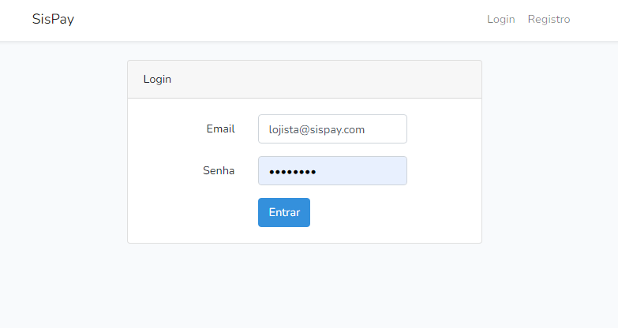

## Instalação 
### Requisitos
 - Docker
 - Porta 8080 liberada.

Execute um dos seguintes comandos:

bash
```
./install.sh
```
ou
CMD
```
install
```
na pasta raiz do projeto

## Iniciando Sispay 
Execute um dos seguintes comandos:
bash
```
./run.sh
```
ou
CMD
```
run
```
na pasta raiz do projeto

Endereço de acesso: http://localhost:8080

## Acessos
<p align="center"></p>
    - Dados de acessos:

         Lojista: 
            email: lojista@sispay.com
            Senha: 123456

        Usuário Comum:
            email: comum@sispay.com
            Senha: 123456


